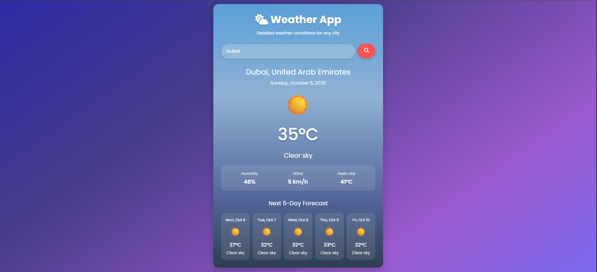

# Weather App

A clean and simple single-page React application to display the weather for any city.  
It fetches real-time weather data and a 5-day forecast from the OpenWeatherMap API, with a responsive and user-friendly design.

## Features

- **City Search:** Enter any city name to get weather information.
- **Current Weather:** Displays temperature, weather condition, humidity, wind speed, and "feels like" temperature.
- **5-Day Forecast:** Shows a daily forecast with icons and temperature.
- **Loading Indicator:** Spinner shown while fetching data.
- **Error Handling:** Clear error message if the city is not found.
- **Responsive Design:** Works well on desktop and mobile.
- **Weather Icons:** Visual icons for different weather conditions.
- **Last City Memory:** Remembers and loads the last searched city using `localStorage`.
- **Dynamic Background:** Background color changes based on weather condition.

## Screenshots





## Getting Started

### Prerequisites

- [Node.js](https://nodejs.org/) (v16+ recommended)
- [npm](https://www.npmjs.com/)

### Installation

1. **Clone the repository:**
   ```sh
   git clone https://github.com/your-username/weather-app.git
   cd weather-app
   ```

2. **Install dependencies:**
   ```sh
   npm install
   ```

3. **Set up API Key: To run this project**
   - For security reasons, the API key is not included in the repository.
   - Register at [OpenWeatherMap](https://openweathermap.org/api) to get a free API key.
   - Create a `.env.local` file in the project root and add the following:
     ```
     VITE_WEATHER_API_KEY=your_openweathermap_api_key
     ```

### Live Demo
Live Link: https://weather-app-ganapuresidhant-gmailcoms-projects.vercel.app/

### Running the App

- **Development mode:**
  ```sh
  npm run dev
  ```
  Open [http://localhost:5173](http://localhost:5173) in your browser.

- **Production build:**
  ```sh
  npm run build
  npm run preview
  ```

### Linting

```sh
npm run lint
```

## Project Structure

```
weather-app/
├── node_modules/
├── public/
│   ├── Screenshot-1.png
│   ├── Screenshot-2.png
│   └── Screenshot-3.png
│
├── src/
│   ├── App.jsx
│   ├── main.jsx
│   ├── styles.css
│   ├── weatherConditions.jsx
│   └── components/
│       ├── CurrentWeather.jsx
│       ├── ErrorMessage.jsx
│       ├── Forecast.jsx
│       ├── Header.jsx
│       ├── Loading.jsx
│       └── SearchBar.jsx
│        
├── .env.local
├── package.json
├── vite.config.js
└── ...
```

## Customization

- **Weather Icons & Conditions:**  
  Edit [`weatherConditions`](src/weatherConditions.jsx) to add or change icons for weather types.
- **Styling:**  
  Modify [`styles.css`](src/styles.css) for custom themes or layouts.

## Credits

- Weather data from [OpenWeatherMap](https://openweathermap.org/).
- Icons from [Font Awesome](https://fontawesome.com/) and Unicode emojis.
- Built with [React](https://react.dev/) and [Vite](https://vitejs.dev/).
